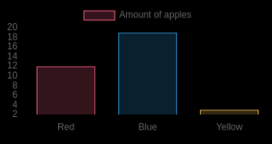

# MMM-Chart

Chart module for [MagicMirror²](https://github.com/MagicMirrorOrg/MagicMirror). This is a simple wrapper for [Chart.js](http://www.chartjs.org/).

## Screenshot


## Installation

In your terminal, go to your MagicMirror's module folder:

```shell
cd ~/MagicMirror/modules
```

Clone this repository:

```shell
git clone https://github.com/evghenix/MMM-Chart
```

Install dependencies:

```shell
cd MMM-Chart
npm install
```

Configure the module in your `config.js` file.

## Using the module

To use this module, add it to the modules array in the `config/config.js` file:

```javascript
  {
    module: "MMM-Chart",
    position: "top_left",
    config: {
      // See 'Configuration options' for more information.
    }
  },
```

## Configuration options

The following property can be configured:

| Option        | Description             | Default value |
| --------------|-------------------------|:-------------:|
| `width`       | Chart width in px.      | `200`         |
| `height`      | Chart height in px.     | `200`         |
| `chartConfig` | Chart.js config. More info at [chartjs.org](http://www.chartjs.org/) | `{}` |

## Working example

```js
    {
      module: "MMM-Chart",
      position: "top_left",
      config: {
        width: "350",
        hight: "250",
        chartConfig: {
          type: "bar",
          data: {
            labels: ["Red", "Blue", "Yellow"],
            datasets: [
              {
                label: "Amount of apples",
                data: [12, 19, 3],
                backgroundColor: [
                  "rgba(255, 99, 132, 0.2)",
                  "rgba(54, 162, 235, 0.2)",
                  "rgba(255, 206, 86, 0.2)"
                ],
                borderColor: [
                  "rgba(255,99,132,1)",
                  "rgba(54, 162, 235, 1)",
                  "rgba(255, 206, 86, 1)"
                ],
                borderWidth: 1
              }
            ]
          }
        }
      }
    },
```

That should look like that:


