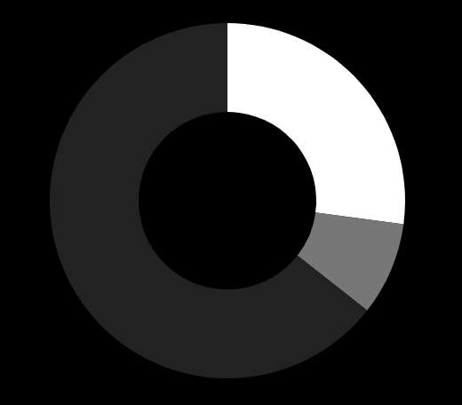

# MMM-Chart
Chart module for [MagicMirror²](https://github.com/MagicMirrorOrg/MagicMirror). This is a simple wrapper for [Chart.js](http://www.chartjs.org/)

## Screenshot


## Installation

In your terminal, go to your MagicMirror's Module folder:
````
cd ~/MagicMirror/modules
````

Clone this repository:
````
git clone https://github.com/evghenix/MMM-Chart.git
````

Install dependencies:
````
cd ~/MagicMirror/modules/MMM-Chart
````

````
npm install
````

Configure the module in your `config.js` file.

## Using the module

To use this module, add it to the modules array in the `config/config.js` file:
````javascript
modules: [
	{
		module: 'MMM-Chart',
		config: {
			// See 'Configuration options' for more information.
		}
	}
]
````

## Configuration options

The following property can be configured:

| Option      | Description             | Default value |
| ------------|-------------------------|:-------------:|
| width       | Chart width in px.      | ```200```     |
| height      | Chart height in px.     | ```200```     |
| chartConfig | Chart.js config. More info at [chartjs.org](http://www.chartjs.org/) | ```{}``` |
